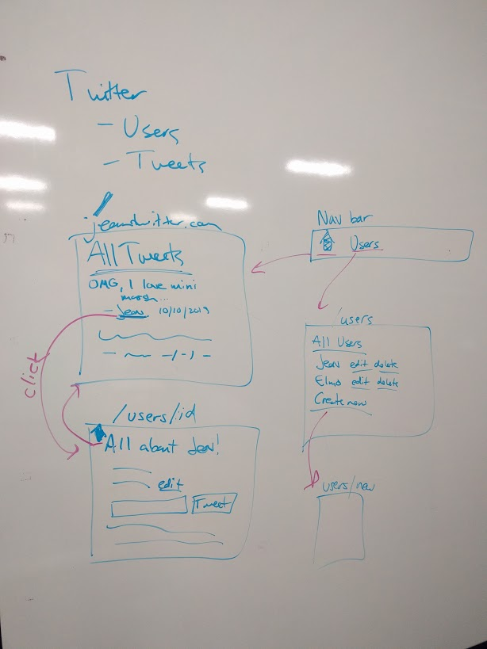
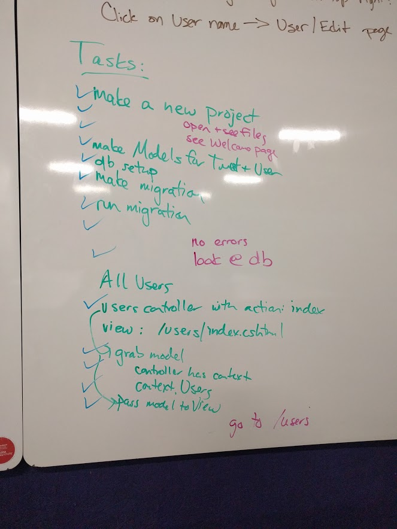

# session_9_mvc_tweets

## What is this?
In-class exercise for Academy Pittsburgh session 9 using the MVC framework to make a twitter clone.

Here is the design we did on the whiteboard of what we were making:


And here is the list of tasks that we checked off while making this:


## How do I use it?
1. change the db listed in Startup.cs to a folder appropriate for your system (make sure you have sqlite installed and working before you start)
2. make sure you have the appropriate nuget packages installed: 
```
dotnet add package Microsoft.EntityFrameworkCore.SQLite
dotnet add package Microsoft.VisualStudio.Web.CodeGeneration.Design
dotnet add package Microsoft.EntityFrameworkCore.Design
dotnet add package Microsoft.EntityFrameworkCore.SqlServer
```
3. use `dotnet run` from the command line
4. open localhost:5001/users in a browser
